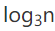

# 复杂度分析

数据结构和算法本身解决的是“快”和“省”的问题，即如何让代码运行得更快，如何让代码更省存储空间。所以，执行效率是算法一个非常重要的考量指标。

> 复杂度分析是整个算法学习的精髓，只要掌握了它，数据结构和算法的内容基本上就掌握了一半。

## 为什么需要复杂度分析

当我们把代码跑一遍以后，可以通过统计、监控得到算法执行的时间和占用内存的大小。这种方法称为**事后统计法**，这种方法有非常大的局限性：

1. **测试结果非常依赖测试环境。**例如不同的硬件对测试结果又很大的影响。
2. **测试结果受数据规模的影响很大。**

所以，我们需要一个不用具体的测试数据来测试，就可以粗略地估计算法的执行效率的方法。

## 如何分析、统计算法的执行效率和资源消耗

### 大O复杂度表示法

```c
 int cal(int n) {
   int sum = 0;
   int i = 1;
   for (; i <= n; ++i) {
     sum = sum + i;
   }
   return sum;
 }

```

如上这段代码，求1,2,3……n的累加和。

从CPU的角度来看，这段代码每一行都执行着类似的操作：**读数据-运算-写数据**。尽管每行代码对应的CPU执行的个数、执行的时间都不一样，但我们只是粗略估计，所以可以假设每行代码执行的时间都一样，为unit_time。

第2、3行代码分别需要1个unit_time的执行时间，第4、5行代码都运行了n遍，所以需要2n×unit_time的执行时间，所以这段代码总的执行时间就是(2n+2)×unit_time的执行时间。可以看出，**所有代码的执行时间T(n)与每行代码的执行次数成正比**

按照以上思路，再来看下面的代码：

```c
 int cal(int n) {
   int sum = 0;
   int i = 1;
   int j = 1;
   for (; i <= n; ++i) {
     j = 1;
     for (; j <= n; ++j) {
       sum = sum +  i * j;
     }
   }
 }
```

设每个语句的执行时间是unit_time。

则 **T(n)=(3+2n+2n^2)×unit_time**

我们可以从上面两个例子中总结出一个重要规律：

**所有代码的执行时间T(n)与每行代码的执行次数成正比**

可以试用公式表示为：
$$
T(n)=O(f(n))
$$
在这个公式中：

**T(n)** 表示代码执行的时间；

**n** 表示数据规模的大小；

**f(n)** 表示每行代码执行的次数总和；

**O** 表示代码的执行时间**T(n)**和**f(n)**表达式成正比。

所以第一个例子中的**T(n) = O(2n+2)**，第二个例子中的**T(n) = O(2n^2+2n+3)**。这就是**大O时间复杂度表示法。**

大O时间复杂度实际上并不具体表示代码真正的执行时间，而是表示**代码执行时间随数据规模增长的变化趋势**，所以也叫做**渐进时间复杂度**(asymptotic time complexity)，简称**时间复杂度**。

当 n 很大时，你可以把它想象成 10000、100000。而公式中的低阶、常量、系数三部分并不左右增长趋势，所以都可以忽略。我们只需要记录一个最大量级就可以了，如果用大 O 表示法表示刚讲的那两段代码的时间复杂度，就可以记为：T(n) = O(n)； T(n) = O(n)。

## 时间复杂度分析

分析一段代码的时间复杂度，有三个比较实用的方法：

### 1. 只关注循环执行次数最多的一段代码

大O这种复杂度表示方法只是表示一种变化趋势。所以，**我们在分析一个算法、一段代码的时间复杂度的时候，也只关注循环次数做多的那一段代码就可以了**。这段核心代码执行次数n的两级，就是整段要分析代码的时间复杂度。

```C
 int cal(int n) {
   int sum = 0;
   int i = 1;
   for (; i <= n; ++i) {
     sum = sum + i;
   }
   return sum;
 }
```

上面的代码中，第2、3行代码都是常量级的执行时间，与n的大小无关，所以对于复杂度并没有影响。循环执行次数最多的是第4、5行代码，所以这块代码要重点分析。

### 2. 加法法则：总复杂度等于量级最大的那段代码的复杂度

```C
int cal(int n) {
   int sum_1 = 0;
   int p = 1;
   for (; p < 100; ++p) {
     sum_1 = sum_1 + p;
   }

   int sum_2 = 0;
   int q = 1;
   for (; q < n; ++q) {
     sum_2 = sum_2 + q;
   }
 
   int sum_3 = 0;
   int i = 1;
   int j = 1;
   for (; i <= n; ++i) {
     j = 1; 
     for (; j <= n; ++j) {
       sum_3 = sum_3 +  i * j;
     }
   }
 
   return sum_1 + sum_2 + sum_3;
 }
```

以上代码分为三部分，分别是求sum_1、sum_2、sum_3。我们可以分析每一部分的时间复杂度，然后再取一个量级最大的作为整段代码的复杂度。

第一段代码循环执行了100次，是一个常量的执行时间，与n无关；

第二段代码代码的时间复杂度是**O(n)**；

第三段代码的时间复杂度是**O(n^2)**。

我们取其中最大的量级，所以，以上整段代码的时间复杂度就是**O(n^2)**。也就是说：**总的时间复杂度就等于量级最大的那段代码的时间复杂度**。

可以抽象为：

如果：
$$
T1(n)=O(f(n))，T2(n)=O(g(n))
$$
那么：
$$
T(n)=T1(n)+T2(n)=max(O(f(n))
$$

$$
O(g(n))) =O(max(f(n), g(n)))
$$


### 3. 乘法法则：嵌套代码的复杂度等于嵌套内外代码复杂度的乘积

 如果：
$$
T1(n)=O(f(n))，T2(n)=O(g(n))
$$
那么：
$$
T(n)=T1(n)*T2(n)=O(f(n))*O(g(n))=O(f(n)*g(n))
$$
假设 **T1(n) = O(n)**，**T2(n) = O(n^2)**，则 **T1(n) * T2(n) = O(n^3)**。

在具体的代码上，我们可以把乘法法则看成是嵌套循环。

```C
int cal(int n) {
   int ret = 0; 
   int i = 1;
   for (; i < n; ++i) {
     ret = ret + f(i);
   } 
 } 
 
 int f(int n) {
  int sum = 0;
  int i = 1;
  for (; i < n; ++i) {
    sum = sum + i;
  } 
  return sum;
 }
```

f()函数是时间复杂度是T2(n)=O(n)，所以，整个cal()函数的时间复杂度就是：
$$
T(n) = T1(n) * T2(n) = O(n*n) = O(n^2)
$$

## 常见时间复杂度实例分析

常见的复杂度量级并不多：

- **常量阶 O(1)**
- **对数阶 O(log n)**
- **线性阶 O(n)**
- **线性对数阶 O(nlog n)**
- **平方阶 O(n^2)、O(n^3)……O(n^k)**
- **指数阶 O(2^n)**
- **阶乘阶 O(n!)**

以上复杂度量级可以粗略的分为两类，**多项式量级**和**非多项式量级**。其中，非多项式量级只有两个O(2^n)和O(n!)。

当数据规模n越来越大时，非多项式量级算法的执行时间会急剧增加，求解问题的执行时间会无限增长。所以，非多项式时间复杂度的算法其实是非常低效的算法。

### 1. O(1)

O(1)只是常量级时间复杂度的一种表示方法，例如下面的代码虽然有三行，但时间复杂度也是O(1)，而不是O(3)

```C
 int i = 8;
 int j = 6;
 int sum = i + j;
```

**一般情况下，只要算法中不存在循环语句、递归语句，即使有成千上万行代码，其时间复杂度也是O(1)**

### 2. O(log n)、O(nlog n)

例子：

```C
 i=1;
 while (i <= n)  {
   i = i * 2;
 }
```

从代码可以看出，变量 i 的值从1开始取，每次循环就乘以2。当大于n时，循环结束。

实际上，变量 i 的取值就是一个等比数列，即：


我们只要知道x的值是多少，就知道这段代码的执行次数了。通过 2^x=求解x，所以，这段代码的时间复杂度是

```C
 i=1;
 while (i <= n)  {
   i = i * 3;
 }
```

稍微修改这段代码，用同样的思路可以得出这段代码的时间复杂度是

对数之间是可以相互转化的，例如=，所以就等于一个O(C*)。其中，C是一个常量，而在采用大O复杂度分析时，可以忽略系数。

所以，不管是以2为底，以3为底，还是其他数字，我们可以把所以对数阶的时间复杂度都记为O(log n)。

时间复杂度O(nlog n)实际上就是一段时间复杂度为O(log n)的代码循环执行n遍。

### 3. O(m+n)、O(m*n)

代码复杂度由两个数据规模来决定

```C
int cal(int m, int n) {
  int sum_1 = 0;
  int i = 1;
  for (; i < m; ++i) {
    sum_1 = sum_1 + i;
  }

  int sum_2 = 0;
  int j = 1;
  for (; j < n; ++j) {
    sum_2 = sum_2 + j;
  }

  return sum_1 + sum_2;
}
```

从代码可以看出，m和n是表示两个数据规模。我们无法实现评估m和n谁的量级大，所以我们不能简单的使用加法法则。所以，上面的代码的时间复杂度是O(m+n)。

针对这种情况，原来的加法法则就不正确了，我们需要将加法规则改为：T1(m) + T2(n) = O(f(m) + g(n))。但是乘法法则继续有效：T1(m)*T2(n) = O(f(m) * f(n))。

## 空间复杂度分析

时间复杂度的全称是**渐进时间复杂度，表示算法的执行时间与数据规模之间的增长关系。**类似的，空间复杂度的全程就是**渐进空间复杂度，表示算法的存储空间与数据规模之间的增长关系。**

```C
void print(int n) {
  int i = 0;
  int[] a = new int[n];
  for (i; i <n; ++i) {
    a[i] = i * i;
  }

  for (i = n-1; i >= 0; --i) {
    print out a[i]
  }
}
```

在第2行代码中，我们申请了一个空间存储变量i，但是它是常量阶的，和数据规模n没有关系，所以可以忽略。第3行代码申请看一个大小为n的int类型数组，除此之外，剩下的代码都没有占用更多的空间，所以，整段代码的空间复杂度就是O(n)。

## 最好、最坏情况时间复杂度

```C
// n 表示数组 array 的长度
int find(int[] array, int n, int x) {
  int i = 0;
  int pos = -1;
  for (; i < n; ++i) {
    if (array[i] == x) pos = i;
  }
  return pos;
}
```

上面这段代码实现的是在一个无序数组(array)中，查找变量x出现的位置，如果没有找到，就返回-1。这段代码的复杂度是O(n)，其中n是数组长度。

在数组中查找一个数据，并不需要每次都把整个数组都遍历一遍，因为中途可能找到就可以提前结束循环。可以这样来优化一下代码：

```C
// n 表示数组 array 的长度
int find(int[] array, int n, int x) {
  int i = 0;
  int pos = -1;
  for (; i < n; ++i) {
    if (array[i] == x) {
       pos = i;
       break;
    }
  }
  return pos;
}
```

修改后的代码在找到x的位置后就跳出循环。

优化过后，这段代码的时间复杂度就不再是O(n)了，因为，要查找的变量x可能出现在数组的任意位置，一旦找到，代码就跳出循环，剩下的个数据就不再需要遍历了，所以在不同情况下，这段代码的时间复杂度是不同的。

为了表示代码在不同情况下的不同时间复杂度，引入了三个概念：最好情况时间复杂度、最坏情况时间复杂度和平均情况时间复杂度。

**最好情况时间复杂度就是，在最理想的情况下，执行这段代码的时间复杂度**

**最坏情况时间复杂度就是，在最糟糕的情况下，执行这段代码的时间复杂度**

## 平均情况时间复杂度

最好和最好情况时间复杂度对应的都是极端情况下的代码复杂度，发生概率并不大。为了更好的表示时间复杂度，我们引入了**平均情况时间复杂度**

在上面的例子中，要查找x在数组中的位置，有n+1中情况：**在数组的0~n-1位置中和不在数组中**。我们把每种情况下，需要遍历的元素个数累加起来，再除以n+1，就可以得到需要遍历的元素个数的平均值，即：
$$
\frac{1+2+3+……+n+n}{n+1}=\frac{n(n+3)}{2(n+1)}
$$
在时间复杂度的大O标记法中，可以省略系数、低阶、常量，所以，把这个公式简化以后，得到的平均时间复杂度就是O(n)。

我们假设x在数组中与不在数组的概率都为1/2，此外，我们要查找的数据出现在n个位置的概率是一样的，为1/n，所以，要查找的数据出现在0~n-1的概率为1/(2n)。

当我们把各种情况发生的概率考虑进去后，平均时间复杂度的计算就需要使用**加权平均值**
$$
1*\frac{1}{2n}+2*\frac{1}{2n}+3*\frac{1}{3n}+……+n*\frac{1}{2n}+n*\frac{1}{2}=\frac{3n+1}{4}
$$
用大O表示法来表示，去掉系数和常量，这段代码的平均时间复杂度任然是O(n)。

## 均摊时间复杂度

例子：

```C
 // array 表示一个长度为 n 的数组
 // 代码中的 array.length 就等于 n
 int[] array = new int[n];
 int count = 0;
 
 void insert(int val) {
    if (count == array.length) {
       int sum = 0;
       for (int i = 0; i < array.length; ++i) {
          sum = sum + array[i];
       }
       array[0] = sum;
       count = 1;
    }

    array[count] = val;
    ++count;
 }
```

这段代码实现了一个忘数组中插入数据的功能。当数组满了以后，也就是count == array.length时，我们用for循环遍历数组求和，并清空数组，讲求和后的sum放到数组的第一个位置，然后再将新的数据插入。但如果数组一开始就要空闲空间，则直接将数据插入数组。

在最理想的情况下，数组中有空闲空间，我们只需要将数据插入到数组下标为count的位置就可以了，所以最好的情况时间复杂度为O(1)。

最坏的情况下，数组没有空闲空间了，我们需要先做一遍数组的遍历求和，然后再将数据插入，所以最坏情况时间复杂度为O(n)。

假设数组长度是n，根据数据插入位置不同，我们可以分为n种情况，每种情况的时间复杂度是O(1)。还有一种情况是没有空闲空间时插入一个数据，这个时候时间复杂度是O(n)。而且，这n+1种情况发生的概率一样，都是1/(n+1)。所以，根据加权平均的计算方法，我们可以求得平均时间复杂度：
$$
1*\frac{1}{n+1}+1*\frac{1}{n+1}+……+1*\frac{1}{n+1}+n*\frac{1}{n+1}=O(1)
$$
对比insert()和前面的find()的例子，我们发现，find()函数在极端情况下，复杂度才为O(1)。但insert()在大部分情况下，时间复杂度都为O(1)。只有在个别情况下，复杂度才比较高，为0(n)。

第二个不同的地方是，O(1)时间复杂度的插入和O(n)时间复杂度的插入，出现的频率是非常有规律的，而且有一定的前后时序关系，一般都是䘝O(n)插入之后，紧跟着n-1个O(1)的插入操作，循环往复。

针对这样一种特殊场景的复杂度分析，我们引入了一种更加简单的分析方法：**摊还分析法**，通过摊还分析得到的时间复杂度叫做：**均摊时间复杂度**

以上面在数组中插入数据的例子来说，均摊分析的大致思路是：每一次O(n)的插入操作，都会跟着n-1次O(1)的插入操作，所以把耗时多的那次操作均摊到接下来的n-1次耗时少的操作上，均摊下来，这一组连续操作的均摊时间复杂度就是O(1)。

对一个数据结构进行一组连续操作中，大部分情况下时间复杂度都很低，只有个别情况下时间复杂度比较高，而且这些操作之间存在前后连贯的时序关系，这个时候，我们就可以将这一组操作放在一块儿分析，看是否能将较高时间复杂度那次操作的耗时，平摊到其他那些时间复杂度比较低的操作上。而且，在能够应用均摊时间复杂度分析的场合，一般均摊时间复杂度就等于最好情况时间复杂度。

